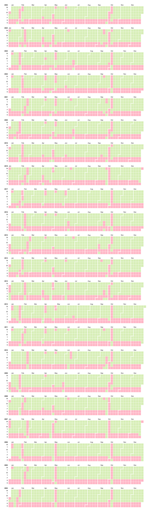

# 中国工作日历

中国工作日历是一个判断指定日期或时间是否为中国官方工作日的Java库。无额外依赖，支持每年的节假日数据自动更新，无需每年升级组件版本。

Chinese Workday Calendar is a Java library that provides functionality to determine workdays and holidays in the Chinese calendar.

## Features

- 判断指定日期或时间是否是一个中国的官方工作日
- 支持每年的节假日数据自动更新
- 支持自定义远程更新地址

## Installation

要将此库包含在您的项目中，请在`build.gradle`文件中添加以下依赖项：

```groovy
dependencies {
    implementation 'io.github.shawyeok:chinese-workday-calendar:2026.0.0'
}
```

或者将以下依赖项添加到您的`pom.xml`文件中：

```xml
<dependency>
    <groupId>io.github.shawyeok</groupId>
    <artifactId>chinese-workday-calendar</artifactId>
    <version>2026.0.0</version>
</dependency>
```

## Quick Start

以下是如何使用 `WorkdayCalendar` 类来判断某个日期是否为工作日的示例：

```java
import io.github.shawyeok.WorkdayCalendar;

public class QuickStart {
    public static void main(String[] args) {
        WorkdayCalendar calendar = WorkdayCalendar.builder().build();

        boolean isWorkday = calendar.isWorkday("2024-10-01");

        System.out.println("Is 2024-10-01 a workday? " + isWorkday);
    }
}
```

## Usage

构造一个`WorkdayCalendar`对象:
```java
// 使用默认配置（支持下一年的节假日数据自动更新）
WorkdayCalendar calendar = WorkdayCalendar.builder().build();

// 自定义远程更新地址, 用于互联网访问受限的场景。由用户提供一个静态文件地址，后续只需要每年维护一次该文件内容即可
WorkdayCalendar calendar = WorkdayCalendar.builder()
    .remoteCalendarUrl("https://example.com/workday.properties")
    .build();
```

判断一个日期是否是工作日:
```java
calendar.isWorkday("2024-10-01");
calendar.isWorkday(LocalDate.now());
calendar.isWorkday(new Date());
calendar.isWorkday(2024, 10, 1);
```

获取指定日期开始（不含）的下一个工作日:
```java
calendar.nextWorkday(LocalDate.now());
```

关于组件版本号的说明:
- `2025.x.y`表示2025年的节假日数据已经包含在组件中，不需要访问远程地址。

## Chart



See the details: https://observablehq.com/d/5624093ac436f7ce

## Credit

本项目生成最初数据时使用了[chinese-calendar](https://github.com/LKI/chinese-calendar)包。

## License

Copyright (C) 2024 Yike Xiao

Licensed under the MIT License
